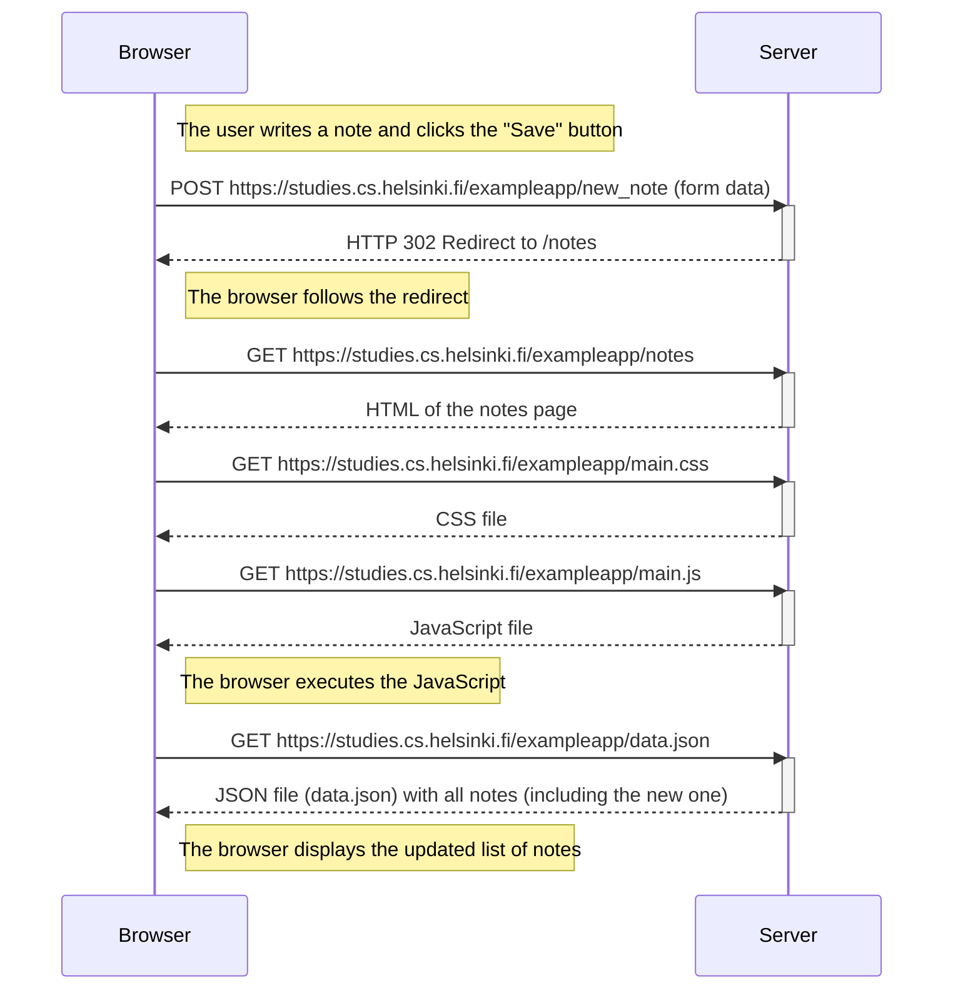

```mermaid
sequenceDiagram
    participant browser as Browser
    participant server as Server

    Note right of browser: The user writes a note and clicks the "Save" button

    browser->>server: POST https://studies.cs.helsinki.fi/exampleapp/new_note (form data)
    activate server
    server-->>browser: HTTP 302 Redirect to /notes
    deactivate server

    Note right of browser: The browser follows the redirect

    browser->>server: GET https://studies.cs.helsinki.fi/exampleapp/notes
    activate server
    server-->>browser: HTML of the notes page
    deactivate server

    browser->>server: GET https://studies.cs.helsinki.fi/exampleapp/main.css
    activate server
    server-->>browser: CSS file
    deactivate server

    browser->>server: GET https://studies.cs.helsinki.fi/exampleapp/main.js
    activate server
    server-->>browser: JavaScript file
    deactivate server

    Note right of browser: The browser executes the JavaScript

    browser->>server: GET https://studies.cs.helsinki.fi/exampleapp/data.json
    activate server
    server-->>browser: JSON file (data.json) with all notes (including the new one)
    deactivate server

    Note right of browser: The browser displays the updated list of notes


```