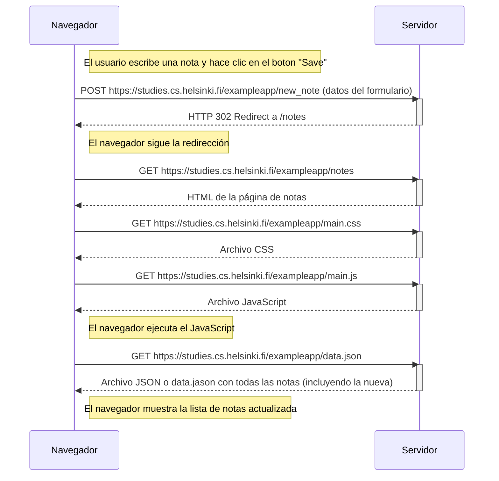

```mermaid
sequenceDiagram
    participant browser as Navegador
    participant server as Servidor

    Note right of browser: El usuario escribe una nota y hace clic en el boton "Save"

    browser->>server: POST https://studies.cs.helsinki.fi/exampleapp/new_note (datos del formulario)
    activate server
    server-->>browser: HTTP 302 Redirect a /notes
    deactivate server

    Note right of browser: El navegador sigue la redirección

    browser->>server: GET https://studies.cs.helsinki.fi/exampleapp/notes
    activate server
    server-->>browser: HTML de la página de notas
    deactivate server

    browser->>server: GET https://studies.cs.helsinki.fi/exampleapp/main.css
    activate server
    server-->>browser: Archivo CSS
    deactivate server

    browser->>server: GET https://studies.cs.helsinki.fi/exampleapp/main.js
    activate server
    server-->>browser: Archivo JavaScript
    deactivate server

    Note right of browser: El navegador ejecuta el JavaScript

    browser->>server: GET https://studies.cs.helsinki.fi/exampleapp/data.json
    activate server
    server-->>browser: Archivo JSON o data.jason con todas las notas (incluyendo la nueva)
    deactivate server

    Note right of browser: El navegador muestra la lista de notas actualizada

```