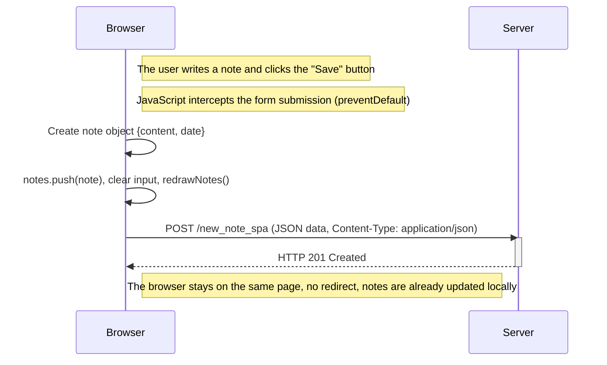

```mermaid
sequenceDiagram
    participant browser as Browser
    participant server as Server

    Note right of browser: The user writes a note and clicks the "Save" button

    Note right of browser: JavaScript intercepts the form submission (preventDefault)

    browser->>browser: Create note object {content, date}
    browser->>browser: notes.push(note), clear input, redrawNotes()

    browser->>server: POST /new_note_spa (JSON data, Content-Type: application/json)
    activate server
    server-->>browser: HTTP 201 Created
    deactivate server

    Note right of browser: The browser stays on the same page, no redirect, notes are already updated locally

```
